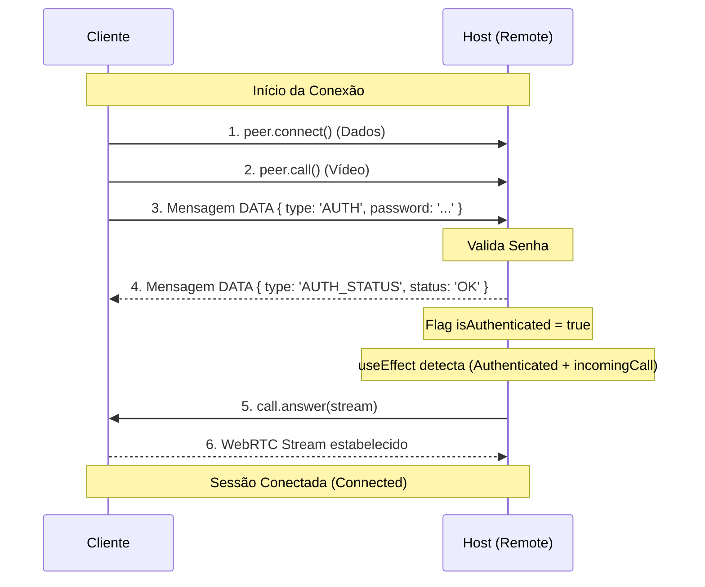

# Fluxo de Autenticação por Senha - MireDesk

Este documento descreve o fluxo técnico completo desde a tentativa de conexão até o estabelecimento da sessão de vídeo autenticada.

## 1. Iniciação (Cliente)
Quando o usuário clica em conectar ou o sistema tenta reconectar com senha salva:
1. O hook `useRemoteSession` aciona `connectTo(remoteId)`.
2. O sistema gera um `sessionId` único.
3. Duas conexões PeerJS são disparadas **simultaneamente**:
   - `peer.call(remoteId, localStream)`: Para o canal de vídeo.
   - `peer.connect(remoteId)`: Para o canal de dados (controle e autenticação).

## 2. Handshake de Dados (Cliente → Host)
1. O canal de dados (`dataConnection`) abre.
2. O Cliente verifica se há uma `pendingPassword`.
3. Se houver, envia imediatamente uma mensagem: `{ type: 'AUTH', password: '...' }`.

## 3. Processamento no Host
O Host recebe o evento de conexão e entra no handler de dados:
1. **Validação**: O Host compara a senha recebida com a `sessionPassword` (definida na UI) ou `unattendedPassword` (acesso não supervisionado).
2. **Resposta**: O Host responde com: `{ type: 'AUTH_STATUS', status: 'OK' | 'FAIL' }`.
3. **Estado**: Se `OK`, o Host marca a sessão interna como `isAuthenticated: true`.

## 4. Estabelecimento do Vídeo (Auto-Atendimento)
Aqui entra a correção recente para evitar "travamentos":
1. **Chegada da Chamada**: A chamada de vídeo (`incomingCall`) pode chegar antes ou depois da mensagem de `AUTH`.
2. **Monitoramento Robusto**: Um `useEffect` no Host fica vigiando continuamente o estado das sessões.
3. **Gatilho de Resposta**: Assim que a sessão tem `isAuthenticated: true` **E** um `incomingCall` presente:
   - O Host executa `call.answer(localStream)` automaticamente.
   - Isso estabelece o stream WebRTC.

## 5. Conclusão da Sessão
1. **Stream Ativo**: Ambos os lados recebem o evento `stream` do PeerJS.
2. **Conexão Total**: O estado da sessão muda para `connected: true`.
3. **Controle Remoto**: O Cliente agora pode enviar comandos de mouse/teclado, e o Host irá processá-los (pois a flag `isAuthenticated` está ativa).

---

### Diagrama de Sequência (Mermaid)

